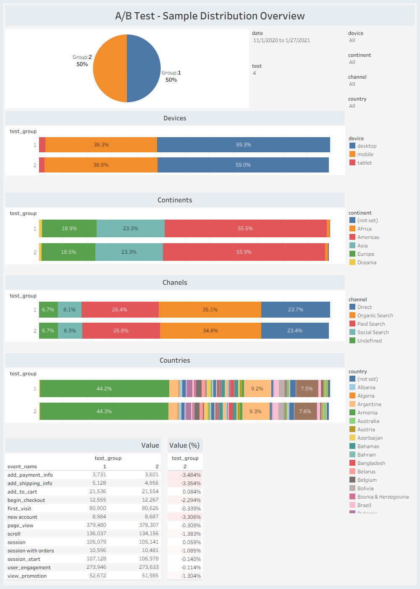
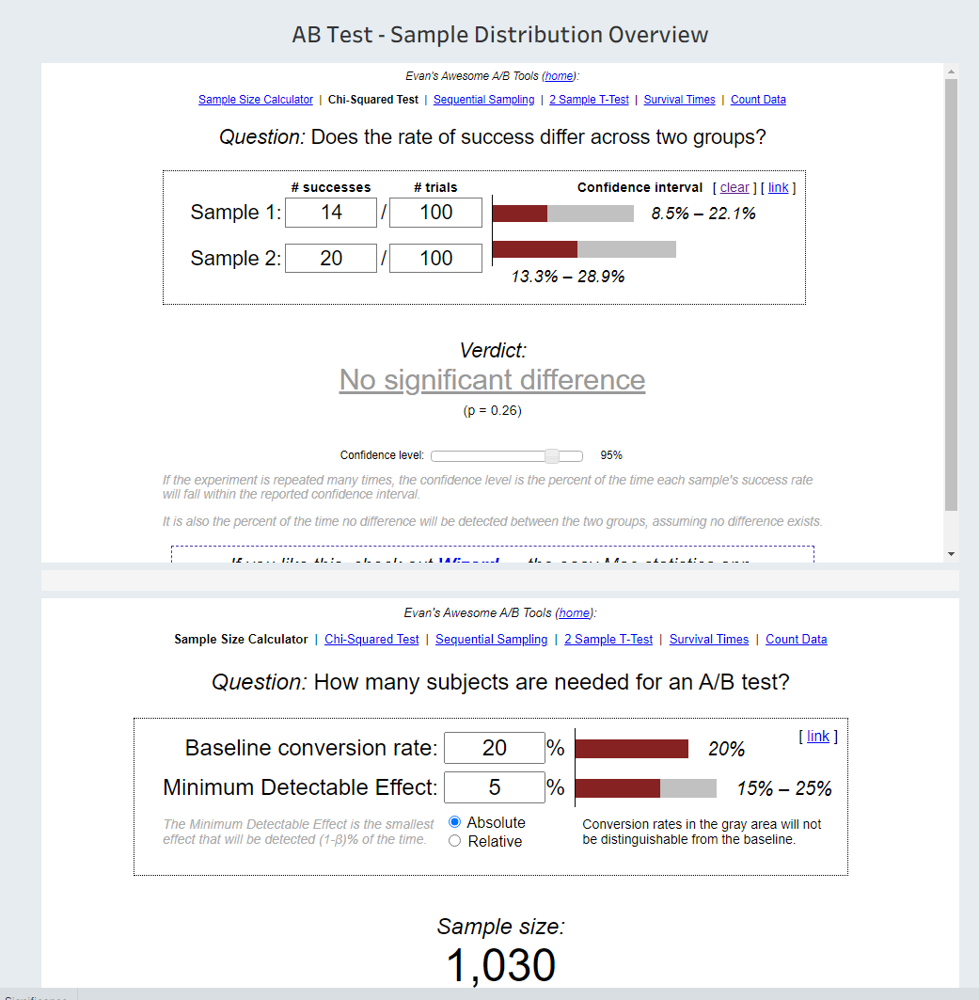
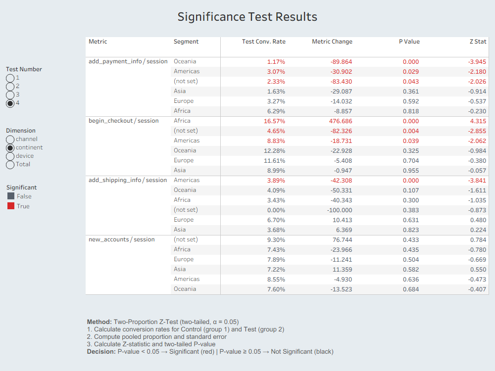

# A/B Testing: Statistical Significance Analysis

## Project Goals

1. **Visualize sample distribution** across each user group (Control vs Test) to verify balanced split by device, continent, channel, and country — ensuring valid test conditions before drawing conclusions.

2. **Analyze A/B test results** using statistical methods in Python and create visualizations that demonstrate key conversion metric performance and statistical significance.

## Project Overview

End-to-end A/B test analysis project that combines **SQL data extraction** (BigQuery), **Python statistical testing** (Google Colab), and **Tableau visualization** (3 interactive dashboards).

The project covers the full A/B testing workflow:
- **Data extraction** — SQL query joining session, event, order, and account data
- **Sample validation** — visual confirmation that Control and Test groups are evenly distributed
- **Sample sufficiency** — external calculators for minimum sample size estimation
- **Statistical analysis** — Two-Proportion Z-Test across 4 metrics and multiple dimensions
- **Business recommendations** — actionable conclusions based on significance results

## Key Metrics

| Metric | Description |
|--------|-------------|
| `add_payment_info / session` | Share of sessions reaching the payment info step |
| `add_shipping_info / session` | Share of sessions reaching the shipping info step |
| `begin_checkout / session` | Share of sessions initiating checkout |
| `new_accounts / session` | Share of sessions resulting in new account creation |

## Methodology

- **Statistical Test:** Two-Proportion Z-Test (two-tailed, alpha = 0.05)
- **Dimensions:** Total, Device, Continent, Channel
- **Tests analyzed:** 4 independent A/B tests
- **Total significance checks:** 240 (4 tests x 4 metrics x multiple dimension values)

For detailed methodology, see [docs/methodology.md](docs/methodology.md).

## Project Structure

```
AB-Testing-Portfolio/
├── README.md
├── data/
│   ├── raw/
│   │   └── SQL_result_started_data_set.csv    # Raw dataset from BigQuery
│   └── processed/
│       └── ab_test_significance_results.csv   # Significance test results
├── sql/
│   └── bigquery_query.sql                     # BigQuery data extraction query
├── notebooks/
│   └── ab_test_significance.ipynb             # Python notebook (Google Colab)
├── tableau/
│   └── AB_Testing_Tool.twb                    # Tableau workbook (3 dashboards)
├── docs/
│   ├── methodology.md                         # Z-test methodology explanation
│   ├── results_interpretation.md              # Results & business recommendations
│   └── images/                                # Dashboard screenshots
├── .gitignore
└── LICENSE
```

## Dashboards

**[View on Tableau Public](https://public.tableau.com/app/profile/roman.fin/viz/ABTestingTool_17658269719190)**

### 1. A/B Test — Sample Distribution Overview
Visualizes the statistical sample distribution across Control (group 1) and Test (group 2) for each experiment. Verifies balanced split by device, continent, channel, and country — a critical prerequisite for valid A/B test conclusions.



### 2. Sample Size Validation
Embedded external calculators (Evan Miller's tools) for chi-squared significance testing and minimum sample size estimation. Helps validate whether collected sample sizes are sufficient for reliable results.



### 3. Significance Test Results
Interactive table displaying statistical significance for all 4 conversion metrics. Powered by Python Z-test calculations. Features:
- Filter by **Test Number** (1–4)
- Filter by **Dimension** (Total / Device / Continent / Channel)
- Color-coded results: **red** = statistically significant, **black** = not significant
- Methodology explanation block with decision rule



## Key Findings

| Test | Significant Metrics | Direction | Recommendation |
|------|-------------------|-----------|----------------|
| **Test 1** | **3 of 4 (payment +12.5%, shipping +6.6%, checkout +6.7%)** | **Positive** | **Implement** |
| Test 2 | 0 of 4 | Neutral | No effect detected — no action |
| Test 3 | 1 of 4 (begin_checkout −3.4%) | Negative | Reject |
| Test 4 | 2 of 4 (checkout −2.4%, new_accounts −3.4%) | Negative | Reject |

**Test 1 is the clear winner**, showing significant improvement across three key funnel stages — payment info, shipping info, and checkout initiation.

For detailed interpretation, see [docs/results_interpretation.md](docs/results_interpretation.md).

## Tech Stack

| Tool | Purpose |
|------|---------|
| **Google BigQuery** | Data storage and SQL extraction |
| **Python 3** (Google Colab) | Statistical significance calculations |
| **Tableau Public** | Interactive dashboard visualization |
| **Git / GitHub** | Version control and portfolio hosting |

### Python Libraries
- `pandas` — data manipulation and aggregation
- `numpy` — numerical computations
- `math` — normal CDF calculation via `erfc` (no scipy dependency)

## How to Run

### Python Notebook
1. Open [notebooks/ab_test_significance.ipynb](notebooks/ab_test_significance.ipynb) in Google Colab
2. Run cell 1 — authenticate with your Google account
3. Run all cells sequentially (data loads directly from BigQuery)
4. Download the generated `ab_test_significance_results.csv`

### Tableau
1. Open `tableau/AB_Testing_Tool.twb` in Tableau Desktop
2. Connect to the processed CSV as a data source
3. Explore the 3 dashboards

## Author

**RS Fin** — Data Analyst

- [Tableau Public Profile](https://public.tableau.com/app/profile/roman.fin)
- [GitHub](https://github.com/rsfin)
